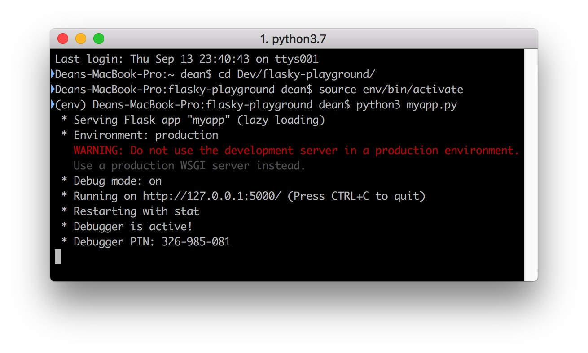
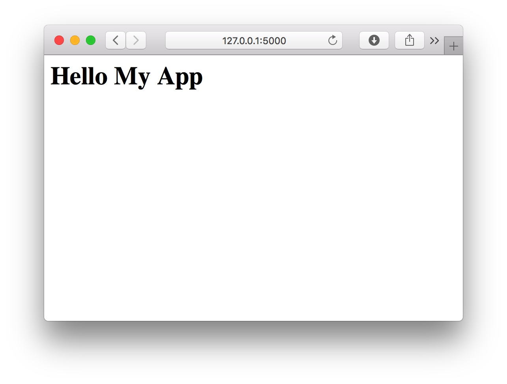
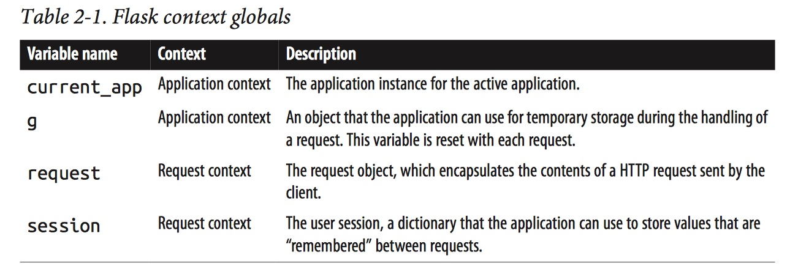
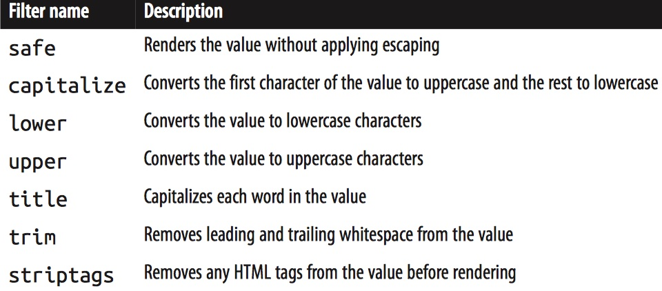

# [Notes] Flask Web Development

## Dependences
 Flask 的主要两大依赖
1. Werkzeug，WSGI 工具库；
2. Jinja2，模版

数据存储方面，用到的是 redis 而不是关系型数据库。redis 是一种内存（in-memory）数据库，仅支持 Unix 系统，但有非官方的 Windows 端。

## Chapter 2. Basic Application Structure
最简单的 Flask 应用：
```python
# hello.py

from flask import Flask
# create Flask instance
app = Flask(__name__) 

# a: route URL to function
@app.route('/')
def index():
	return '<h1>Hello My App</h1>'

# b: dynamic route
@app.route('/user/<name>')
def user(name):
	return '<h1>hello, %s!</h1>' % name

# c: start server
if __name__ == '__main__':
	app.run(debug=True)
```

目录结构：
- Project Directory
	- templates -\> Jinja2 files
	- static -\> images, JS, CSS

### Routes and View Functions
客户端向服务器发送一个请求，Flask app 的实例接受这个请求，对于这个应用实例，它需要知道对于每一条 URL 请求执行什么操作，所以它有一套 URL 对应到 Python 函数的匹配规则。这种对 URL 和函数之间的联系的处理就叫 **route**。

最简单的定义一个 route 的方式是用 `Flask` 实例提供的装饰器 `route` 来修饰函数。如注释 `a`，这样就把 `index()` 函数注册为应用根目录下的 handler。比如域名是 *www.abc.com*，则访问 *http://www.abc.com* 时就会触发这个 `index()` 函数，客户端收到的 response 即是其返回值。

但是这样将响应（HTML 字符串）嵌入到 Python 代码里面非常不利于维护，第三章会介绍更合适的生成响应的方式。

类似 `index()` 这样的函数被称为视图函数（**view function**）。

使用动态元素（**dynamic component**）可以动态地 route URL（注释 `b`）。Flask 支持的 route 类型有 `string` `int` `float` 和 `path`。`path` 与 `string` 的区别是前者不会把 `/` 作为分隔符。
示例：`/user/<int:id> `

### 运行
用 `Flask` 实例的 `app()` 方法来启动服务器（注释 `c`）。然后执行 Python 程序。
 


### 请求、响应周期

#### a. (Application and Request) Contexts
Flask 有两种场景（**context**），四个全局场景变量（**context variables**）：


在派发一个请求前，Flask 会激活（activates/pushes）两种 contexts，当请求处理完毕时移除。

如上表所示，当 application context 被激活，变量 `current_app` 和 `g` 会在线程中可用；request context 激活时同理。如果 context 没有被激活时就访问到变量，会生成错误。
```
>>> from hello import app # Flask instance
>>> from flask import current_app # context variable
>>> current_app.name 
Traceback (most recent call last):
...
RuntimeError: working outside of application context

>>> app_ctx = app.app_context() # obtain application context
>>> app_ctx.push()
>>> current_app.name 
'hello'
>>> app_ctx.pop()
```

#### b. Request Dispatching
用 `Flask` 的 `url_map` 属性可以查看实例中已有的 route map。
```
(env) $ python3
>>> from hello import app
>>> app.url_map 
Map([<Rule '/' (HEAD, OPTIONS, GET) -> index>, 
 <Rule '/static/<filename>' (HEAD, OPTIONS, GET) -> static>,
 <Rule '/user/<name>' (HEAD, OPTIONS, GET) -> user>])
```

注意到这里第二个 rule 不是我们用 `app.route` 装饰器定义的，这是 Flask 特供的用于访问静态资源的 route，关于静态文件会在第三章提到。

`(HEAD, OPTIONS, GET)` 代表的是请求方法（**request method**），Flask 为 route 附上请求方法，这样能实现对于访问同一个 URL 的不同请求，调用不同的 view function。关于区别不同的请求方法会在第四章提及。

#### c. Request Hooks
钩子函数，定义请求派发的前后执行的函数，类似 Java Web 中的过滤器，后面还会提及。

#### d. Response
上面的 view function 中我们返回的响应是简单的 HTML 字符串，但我们还可以返回一个 `Response` 对象。可以用 `make_response()` 这个静态方法生成，用它还可以进行 cookie 设置等操作。
```python
from flask import make_response 

@app.route('/') 
def index():
    response = make_response('<h1>This document carries a cookie!</h1>') 
    response.set_cookie('answer', '42') 
    return response
```

如果要进行重定向，常用 `redirect(another_url_path)`，它也返回一个 `Response` 对象。

如果要进行错误处理，`abort(404)` 能返回 404 状态码。不过要注意的是它不会把控制交还给调用它的函数，而是交还 web 服务器抛出异常。
```python
from flask import abort 

@app.route('/user/<id>') 
def get_user(id):
    user = load_user(id) 
    if not user:
        abort(404) 
    return '<h1>Hello, %s</h1>' % user.name
```

### Flask 扩展
如果我们要对 Flask 服务器进行配置，可以在 `app.run()` 中添加参数，但更方便的方式是通过命令行传参。

先安装 `flask-script`：
```
(venv) $ pip install flask-script
```

用 `Manager` 类接管 Flask app：
```python
from flask.ext.script import Manager 
manager = Manager(app)

# ...

if __name__ == '__main__':
    manager.run()
```

这时候再运行程序，就会提示提供参数了：
```
(env) $ python3 hello.py
usage: hello.py [-?] {shell,runserver} ...

positional arguments:
  {shell,runserver}
	shell            Runs a Python shell inside Flask application context.
	runserver        Runs the Flask development server i.e. app.run()

optional arguments:
  -?, --help         show this help message and exit
```
安装提示，比如要启动服务器：
```
(env) $ python3 hello.py runserver
```
配置 host（a.b.c.d:5000）使服务器在局域网络中可访问：
```
(env) $ python hello.py runserver --host 0.0.0.0 
```

## Chapter 3. Templates
从第二章了解到，view function 的任务是针对请求生成响应，这对简单的请求没问题，但如果稍微复杂一点就会发现矛盾。比如用户发起一个注册请求，view function 需要 1) 访问数据库创建新记录 2) 生成响应发送给客户端。这样就把业务逻辑（**business logic**）和展示逻辑（**presentation logic**）混淆在了一起，导致代码难以理解且不利于维护。

把展示层逻辑转移到模版（**template**）即可以提高可维护性。模版是包含响应文本的 HTML 文件，数据由占位符变量表示。而把变量替换为真实的数据的过程就叫做渲染（**rendering**）。

### Jinja2 模版渲染引擎
Jinja2 模版语法和变量的使用

```python
from flask import Flask, render_template # import rendering method
app = Flask(__name__)

@app.route('/')
def index():
	return render_template('index.html') # refer to templates/index.html

@app.route('/user/<name>')
def user(name):
	return render_template('user.html', name=name) # dynamic component
```

在模版文件中使用构造器 `{{ variable }}` 来获得变量：
```html
<!-- templates/user.html -->
<h1>Hello, {{ name }}!</h1>
```

#### Jinja2 variable filters
Jinja2 提供了一些实用的变量过滤器，查阅[官方文档](http://jinja.pocoo.org/docs/2.10/templates/)获取更多用法。

例如，Jinja2 默认会对变量进行转义，如果需要传递 HTML 代码，用 `safe` 来避免转义：`{{ variable_name|safe }}`。但要注意，永远不要对不可信变量使用 `safe` 过滤（比如用户提交的表单）。

#### Control Structures
条件判断：
```
 
    Hello, {{ user }}! 

    Hello, Stranger! 

```

循环语句：
```

    {{ comment }}

```

宏（macro），类似 Python 中的函数：
```html
 
    <li>{{ comment }}</li> 


<ul>
     
        {{ render_comment(comment) }} 
     
</ul>
```

为了提高 macros 的可用性，可以放到一个单独的 html 文件中，在模版通过 `import` 导入：
```
 
{{ macros.render_comment(comment) }} 
```

重复使用的模版代码也可以单独拿出来，在需要的时候导入：
```

```

更进一步，可以用模版继承来完善代码结构。首先创建一个基本模版：
```html
<html> 
<head>
    
    <title> - My Application</title>
     
</head> 
<body>
    
     
</body> 
</html>
```
实现继承的模版：
```html
 
Index 

    <!-- 如果被继承的 block 中包换元素，用 super() 获取 -->
    {{ super() }} 
    <style>
    </style> 
 
 
<h1>Hello, World!</h1> 

```

**由于修饰笔记耗费太多的时间，为了加快进度，从这里开始往后改变以笔记为首的学习方式，多做引用和直接在原书上批注（这样的话可能以后随时按需拓展）**

### Twitter Bootstrap Integration with Flask Bootstrap
Bootstrap 是 Twitter 的开源框架，它提供创建网页的用户界面接口，兼容性好。简单的说就是一个 CSS 和 JS 库。

使用 Bootstrap 有多种方式，可以将编译过的 CSS 和 JS 文件下载下来放到项目中、用包管理器安装、或者用 Bootstrap 官方提供的免费 CDN（通过 HTML `<link>`）。在这里，我们使用第二种方式。

如何加载 Bootstrap：
1. 通过虚拟环境安装包
```
(env) $ pip install flask-bootstrap
```
2. 在 Python 程序中导入 `Bootstrap` 模块
3. 用 Flask 应用作为构造器参数实例化 `Bootstrap`（变量名称不重要）
```python
from flask_bootstrap import Bootstrap
app = Flask(__name__)
instance = Bootstrap(app)
```
4. 通过 Jinja2 导入
```Jinja2

```

Bootstrap 本身是在 base template 的 `styles` 和 `scripts` block 里面定义的，所以如果要继承这两个 block，一定要加上 `{{ super() }}`。

可供使用的 blocks 参考：[https://pythonhosted.org/Flask-Bootstrap/basic-usage.html](https://pythonhosted.org/Flask-Bootstrap/basic-usage.html)

### 链接处理
Flask 提供了一个 `url_for()` 方法。几种用法举例：
1. 为 URL 填入动态元素
`url_for('user', name='john')` -\> */user/john.*
2. 设置请求参数字符串
`url_for('index', page=2)` -\> */?page=2*
3. 指定为外部链接
`url_for('index', _external=True)` -\> *http://localhost:5000*
4. 链接到 static 目录下的 CSS 文件
`url_for('static', filename='css/styles.css')` -\> */static/css/styles.css*

下面是用 Jinja2 导入一些头部文件的示例：
```Jinja2
 
{{ super() }} <!—- 注意要继承 Bootstrap 中的 head -—>
<link rel="shortcut icon" href="{{ url_for('static', filename = 'favicon.ico') }}" type="image/x-icon"> 
<link rel="icon" href="{{ url_for('static', filename = 'favicon.ico') }}" type="image/x-icon"> 

```

### 用 Flask-Moment 实现时区的本地化
为了统一标准，服务器时间都使用 UTC 标准时间，时区现实的本地化在客户端浏览器完成。moment.js 是一个开源的客户端的 JS 库，Flask 的拓展将它和 Jinja2 模版进行了整合，这就是 Flask-Moment。

安装：
```
(env) $ pip install flask-moment
```
初始化：
```python
from flask.ext.moment import Moment 
moment = Moment(app)
```

除了 moment.js，Flask-Moment 还依赖于 jquery.js，不过 Bootstrap 已经包含了对前者，所以我们只需要手动导入 moment.js。

1. Import module
```python
from flask_moment import 
```
2. Initialization
```python
moment = Moment(app) 
# `app` refers to Flask instance
# again, the name in the left is irrelevant.
```
3. Pass time object to template
```python
@app.route('/')
def index():
	return render_template('index.html', current_time=datetime.utcnow())
```
4. Present local date and time in Jinja2
```Jinja2
<p>The local date and time is {{ moment(current_time).format('LLL') }}.</p>
<p>That was {{ moment(current_time).fromNow(refresh=True) }}.</p>
{# 
The local date and time is September 17, 2018 8:29 PM.
That was a few seconds ago. 
*}
```

## Chapter 4. Web Forms
这一章讨论模版与用户的交互。

通过 POST 提交的表单用 `request.form` 获取

**WTForms** 是 Python web 开发中一个灵活的表单验证即渲染库。它与框架无关，可以搭配任何一种 web 框架和模版引擎使用。


安装：
```
(env) $ pip install flask-wtf
```

### CSRF 保护
跨站请求伪造（cross-site request forgery, CSRF）是一种恶意的攻击，盗用经过验证的用户身份执行未经授权的命令，如发送邮件、发消息、盗取账号、转账等隐私风险。

什么情况下会发生这种情况呢？比如你在一家安全措施薄弱的银行网站进行了登录操作，然后打开了另一个不安全网站，这个网站就可以利用你的 cookie 中的登录信息，伪造一个由浏览器发出的转账请求。所以 CSRF 利用到的漏洞在于 web 的隐式身份验证机制，WEB的身份验证机制虽然可以保证一个请求是来自于某个用户的浏览器，但却无法保证该请求是用户批准发送的[^1]。

要实现 CSRF 保护，Flask-WTF 需要应用配置一个密匙。

### Form Classes
当使用 Flask-WTF 时，每一个表单都由 `Form` 的一个子类表示，这个类定义了表单中的元素，每一个都用一个对象表示。可以为每个单独的对象附上一或多个校验器（validator）来确保用户提交的有效内容。

像这样定义一个表单类：
```python
from flask.ext.wtf import Form 
from wtforms import StringField, SubmitField 
from wtforms.validators import Required

class NameForm(Form):
    name = StringField('What is your name?', validators=[Required()]) 
    submit = SubmitField('Submit')
```

传入构造器的参数，即 `Form` 基类，是属于 Flask-WTF 扩展下的；而 HTML field 和 validator 是在 WTForms 包中定义的。

[^1]:	[http://www.cnblogs.com/hyddd/archive/2009/04/09/1432744.html](http://www.cnblogs.com/hyddd/archive/2009/04/09/1432744.html)