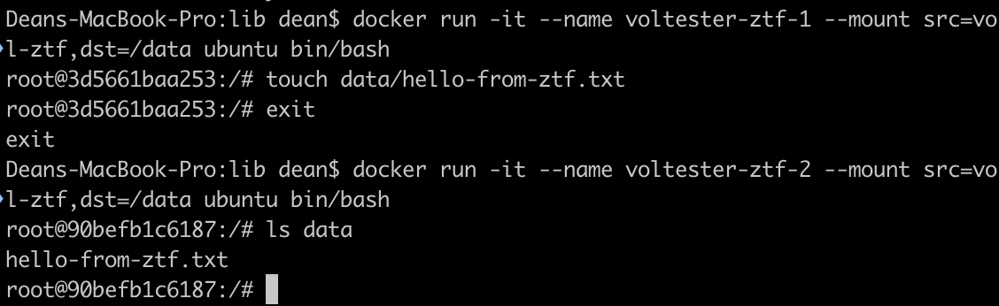
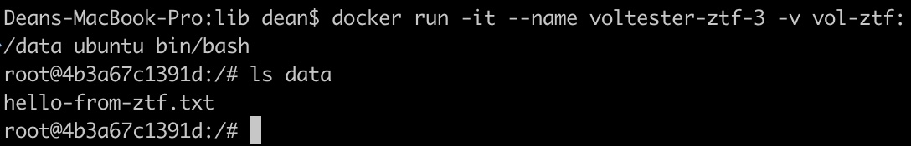
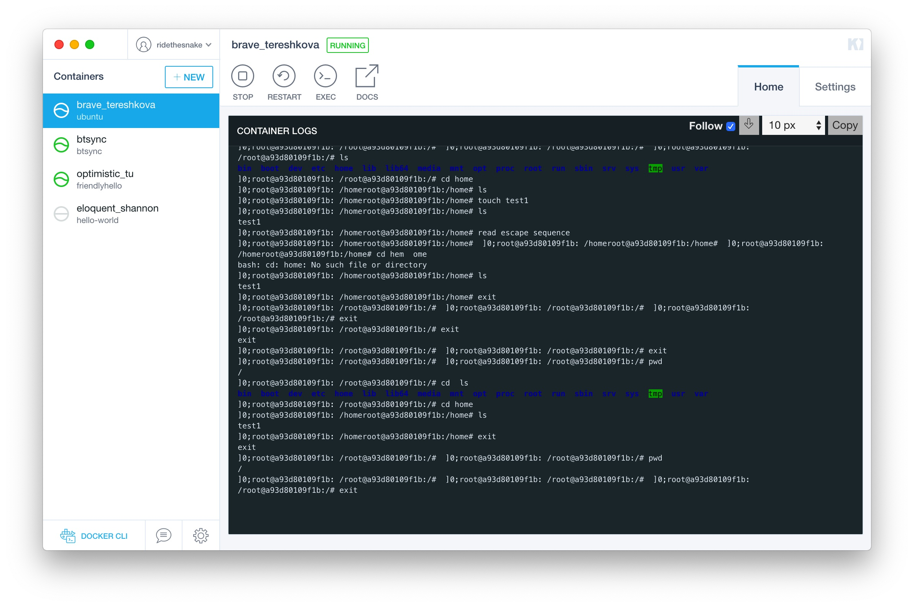
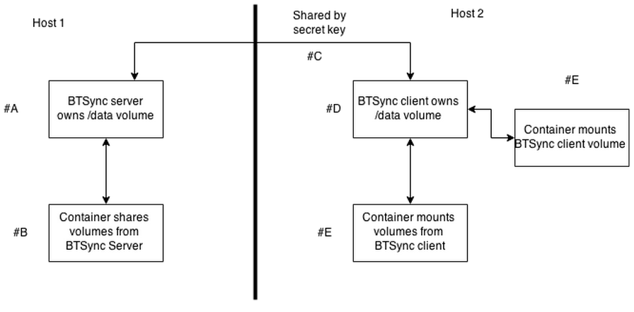

# Learning Docker

## Dock CE 的安装
macOS 下直接安装 dmg 应用即可，所以只说明 Ubuntu 下的操作。

### 方式一：以仓库方式安装
1. 更新 `apt` 包索引
```bash
$ sudo apt-get update
```
2. 安装必要的包，并启用 `apt` 通过 HTTPS 使用仓库
```bash
$ sudo apt-get install \
    apt-transport-https \
    ca-certificates \
    curl \
    software-properties-common
```
3. 添加 Docker 官方的 GPG key
```bash
$ curl -fsSL https://download.docker.com/linux/ubuntu/gpg | sudo apt-key add -
```
校验指纹为 `9DC8 5822 9FC7 DD38 854A E2D8 8D81 803C 0EBF CD88`
```bash
$ sudo apt-key fingerprint 0EBFCD88
```
4. 设置 Docker 仓库，信息会写到 `/etc/apt/sources.list`，`lsb_release -cs` 子命令返回的是该 Ubuntu 分发版的名称
```bash
$ sudo add-apt-repository \
   "deb [arch=amd64] https://download.docker.com/linux/ubuntu \
   $(lsb_release -cs) \
   stable"
```
除了 `stable` 外还有 `edge` `test` 等仓库。
5. 更新包索引并安装 Docker CE
```bash
$ sudo apt-get update
$ sudo apt-get install docker-ce
```

### 方式二：手动安装
1. 从 [docker.com](https://download.docker.com/linux/ubuntu/dists/bionic/pool/stable/amd64/)下载对应的 `.deb` 文件
2. 安装，完成后 Docker daemon 会自动运行
```bash
$ sudo dpkg -i /path/to/package.deb
```

## 容器与镜像管理
容器与镜像的几点区别：
1. 镜像是一个可执行的包，包含了应用运行所需要的所有东西——代码、运行环境、库、环境变量、配置文件等；
2. 容器是镜像的运行环境实例，在镜像被执行时创建出来，用 `docker ps` 命令可以查看运行的容器；
3. 镜像只读，容器可写。

简单贴几个基本的操作命令。
- 从 ubuntu 镜像创建容器
```bash
$ docker container create --name CONTAINER --hostname software_docker -mac-address 00:01:02:03:04:05 --ulimit nproc=1024:2048 -it ubuntu /bin/bash
```
- 启动容器
```bash
$ docker container start CONTAINER
```
- 运行容器，这个可以替代前两步操作（`run` = `create` + `start`）
```bash
$ docker container run --name CONTAINER --hostname software_docker -mac-address 00:01:02:03:04:05 --ulimit nproc=1024:2048 -it ubuntu /bin/bash
```
- 运行 Ubuntu 镜像并进入伪终端（ctrl + P, Q 退出交互模式，`exit` 退出）
```bash
$ docker container run -it ubuntu /bin/bash
```
- 停止容器
```bash
$ docker container [OPTIONS] CONTAINER [CONTAINER…]
```
- 暂停容器
```bash
$ docker container pause CONTAINER [CONTAINER…]
```
- 使用 attach 操作将本地标准输入输出流连接到一个运行的容器
```bash
$ docker container attach [OPTIONS] CONTAINER
```

其它的还有重启 `restart`、查看修改 `diff`、显示进程 `top`、删除 `rm` 等、`inspect` 查看容器信息等。

几个常用的 `container run` 命令选项：
- `-r` 容器退出后自动移除
- `-i` 交互模式
- `-t` 分配一个伪终端
- `-p` 将容器端口映射到主机
- `-v` 指定数据卷

## 应用数据的管理
第一步，选择挂载类型：
1. *Volumes*。Volume 是由 Docker 管理的、独立于容器之外的（但它也可以在运行容器时自动创建）存储在 `/var/lib/docker/volumes` 目录下；
2. *Bind mounts*。指容器挂载 host 上的目录，当 host 和容器之间需要紧密的文件共享时使用；
3. *tmpfs mounts*。临时文件系统，数据将不写到容器可写层，而是写到内存，当不需要 persist 数据的时候使用。

Volume 相对于 bind mount 有包括以下优点：
- 更易于备份和迁移
- 用 Docker CLI 管理
- Linux 和 Windows 容易都可用
- 可以在多个容器间更安全的共享

第二步，选择 flag。为容器挂载一种存储时，需要用到以下命令选项中的一种：
1. `-v` or `—volume`
2. `-mount`

区别罗列如下：
- `-v` 的所有选项在一个 field 里面；`-mount` 的语法则是分开的多个键值对，相对比较简单
- 对于 volume 的挂载，如果要指定 volume driver 选项（实现挂载远程 volume 等），就必须使用 `-mount`
- 对于 bind mount 挂载，`-v` 和 `-mount` 的区别只有一点：如果绑定的主机目录不存在，`-v` 会自动创建新的目录，而 `-mount` 会提示错误

下面两个演示命令，从 nginx 镜像运行容器，并分别用 `-mount` 和 `-v` 挂载（自动生成的）卷，两者效果是一样的：
```bash
$ docker run -d --name devtest --mount src=MY_VOLUME,dst=/app nginx:latest

$ docker run -d --name devtest -v MY_VOLUME:/app nginx:latest
```

不同容器中共享卷的实现：


使用 `-v` flag 挂载的实现：


其它技巧：
- 查看容器使用的是哪种存储类型
```bash
$ docker inspect -f '{{range .Mounts}}{{.Type}}{{end}}' CONTAINER
```
- 查看有哪些容器使用了指定的 volume
```bash
$ docker ps -f volume=VOLUME -a
```

## GUI 终端的实现
> 系统环境：macOS 10.14

前往 [https://kitematic.com/](https://kitematic.com/)，下载并解压，将解压后的应用放入 `/Applications` 目录，然后在 Spotlight 中输入 “Kitematic” 并运行，或者在 Docker 状态栏程序菜单中选择 Kitematic 选项。以下为应用主界面。


## 容器的远程挂载

### 方案一：基于 BitTorrent Sync 技术的分布式卷
这种情况适用于没有大型存储设备的团队，用去中心化的方式来共享文件。

解决方式：用 BitTorrent Sync 镜像来共享卷。


A：BTSync 服务端作为一个 Docker 容器，挂载了将要分享的卷 `/data`
B：同一个主机上的另一个容器，它共享 BTSync 服务端上的卷
C：另一个网络上的客户端，使用 BTSync 服务端生成的 key 以经过 BT 协议引用到共享的数据
D：BTSync 客户端，挂载 BTSync 服务器上的卷，从而达到数据同步
E：客户机上的其它容器，同样能共享来自 BTSync 客户端的卷

在第一台主机服务器运行以下命令以配置容器：
```bash
[A]
$ docker run -d -p 8888:8888 -p 55555:55555 --name btsync ctlc/btsync

$ docker logs btsync
Starting btsync with secret: [B]ALSVEUABQQ5ILRS2OQJKAOKCU5SIIP6A3 By using this application, you agree to our Privacy Policy and Terms.  [http://www.bittorrent.com/legal/privacy http://www.bittorrent.com/legal/terms-of-use](http://h/) total physical memory 536870912 max disk cache 2097152 Using IP address 172.17.4.121

[C]
$ docker run -i -t --volumes-from btsync ubuntu /bin/bash

[D] 
$ touch /data/shared_from_server_one
```
A：从 ctlc/btsync 镜像运行容器
B：记住容器的 key 值，待会要用到
C：交互式模式启动 ubuntu 容器，从 `btsync` 加载卷
D：添加文件到 `/data` 卷

在第二台主机运行以下命令，以实现卷的同步：
```bash
[A]
$ docker run -d --name btsync-client -p 8888:8888 -p
 55555:55555 ctlc/btsync ALSVEUABQQ5ILRS2OQJKAOKCU5SIIP6A3 

[B]
$ docker run -i -t --volumes-from btsync-client ubuntu bash 

[C]
$ ls /data 
shared_from_server_one 

$ touch /data/shared_from_server_two 
```
A：末尾替换为前面生成的 key 值，pull 并启动 `btsync` 客户端容器
B：交互模式启动挂载了 `btsync-client` 上的卷的容器
C：第一台主机创建的文件被移交到了第二台主机

在第二台主机创建第二个文件 `shared_from_server_two`

回到第一台主机运行的容器，能看到文件已经被同步了
```bash
$ ls /data
shared_from_server_one  shared_from_server_two
```

注意事项：
1. 同步的时间没有保证，所以对于大型文件可能会很慢
2. 由于数据是通过互联网传播，并且是有不受自己控制的协议处理，安全性、扩展性和性能方面都有局限

### 方案二：透过 NFS 共享
适用于已有 NFS 存储方案的企业。

但 Docker 并不原生支持 NFS，所以不能直接在每个 NFS 客户端容器挂载远程目录，而是应该使一个容器扮演转译者的角色，把 NFS 变换为 Docker 领域内的卷的概念。

简述：把 NFS 服务器下的 `/export` 目录绑定挂载到 infrastructure container 的 `/mnt`，如此一来，就由这个容器来扮演中间人的角色，提供对外部的访问接口。